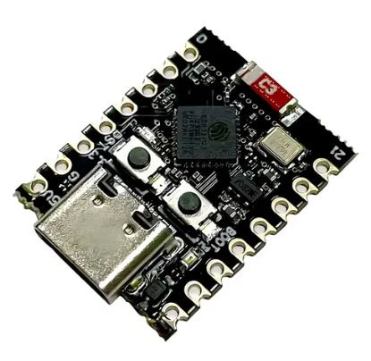

# ESP Unchained Bluetooth Controller Firmware

ESP-IDF firmware that turns an Espressif chip into a Bluetooth HCI controller reachable over USB or UART with advanced features unlocked through vendor-specific HCI opcodes.

## Supported hardware

| Board                   |                                        Image                                         |  Target   | Transport              |    Display     |
| :---------------------- | :----------------------------------------------------------------------------------: | :-------: | :--------------------- | :------------: |
| **ScapyCon 2026 badge** |     | `esp32c5` | Native USB-Serial/JTAG | ST7789 320×240 |
| **ESP32-C3 SuperMini**  |  | `esp32c3` | Native USB-Serial/JTAG |       -        |

## Documentation

* [Building](doc/development/building.md)
