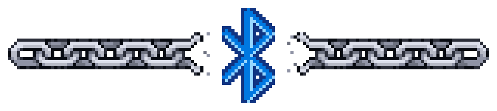
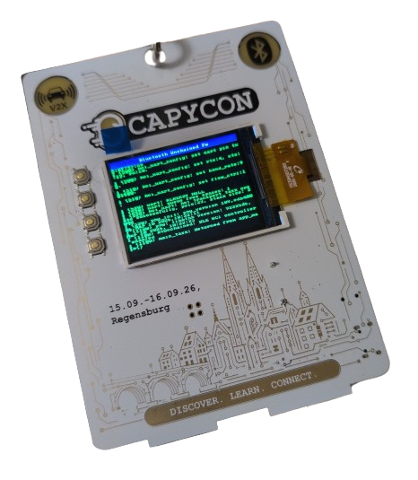
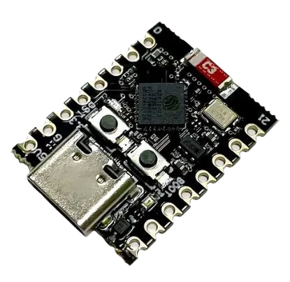
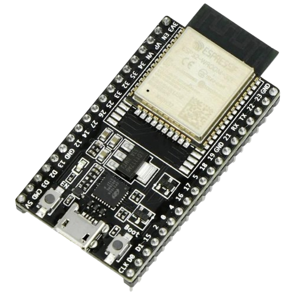

# ESP Unchained Bluetooth Controller Firmware

ESP-IDF firmware that turns an Espressif chip into a Bluetooth HCI controller reachable over USB or UART with advanced features unlocked through vendor-specific HCI opcodes.

## Supported hardware

| Board                                          |                                        Image                                         |  Target   | Transport                        |    Display     |
| :--------------------------------------------- | :----------------------------------------------------------------------------------: | :-------: | :------------------------------- | :------------: |
| **ScapyCon 2026 badge**                        |     | `esp32c5` | Native USB-Serial/JTAG           | ST7789 320×240 |
| **ESP32-C3 SuperMini**                         |  | `esp32c3` | Native USB-Serial/JTAG           |       -        |
| **ESP32-DevKitC-32E** / **ESP32-DevKitC-32UE** |     |  `esp32`  | UART0 @ 921600 (USB-UART bridge) |       -        |

## Features

|  Target   |    Radio    | Core ver. |         VSC         | BDADDR | RX ADV CH | LMP Mon | LL Mon |
| :-------: | :---------: | :-------: | :-----------------: | :----: | :-------: | :-----: | :----: |
|  `esp32`  | BR/EDR + LE |    4.2    |     **Custom**      |   ✓    |           |         |        |
| `esp32c3` |     LE      |    5.0    | **Stock Espressif** |        |           |         |        |
| `esp32c5` |     LE      |    6.0    | **Stock Espressif** |        |           |         |        |

## Documentation

* [Usage](doc/usage.md)
* [Building](doc/development/building.md)
