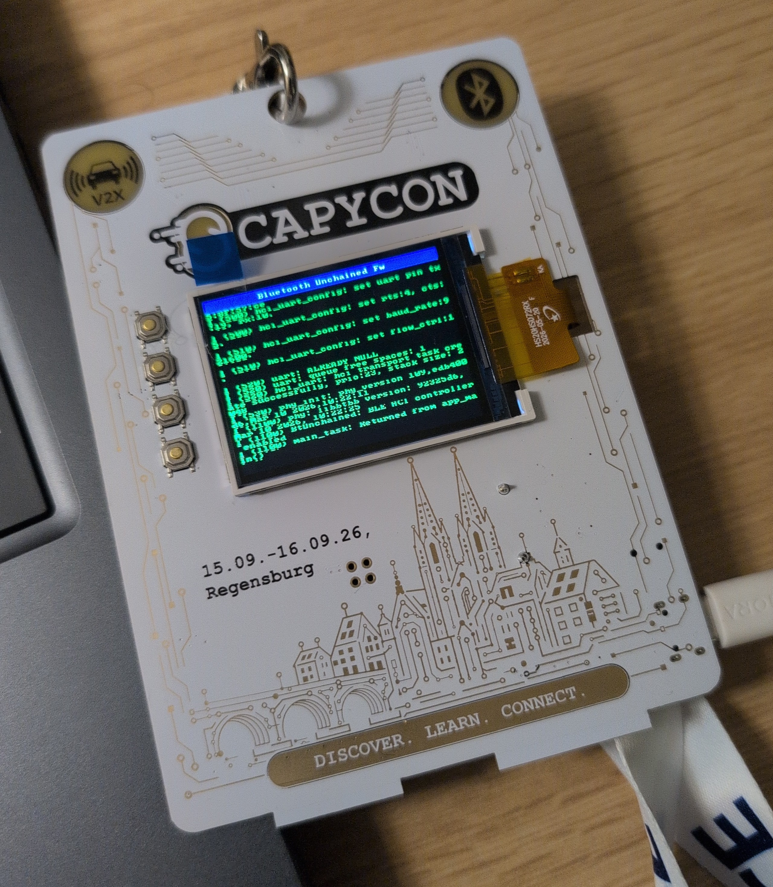

# ESP Unchained Bluetooth Controller Firmware

ESP-IDF firmware that turns an Espressif chip into a bare Bluetooth HCI controller reachable over USB or UART.
The firmware also tries to enable advanced features via vendor specific HCI opcodes.

## Documentation

* [Building](doc/development/building.md)
